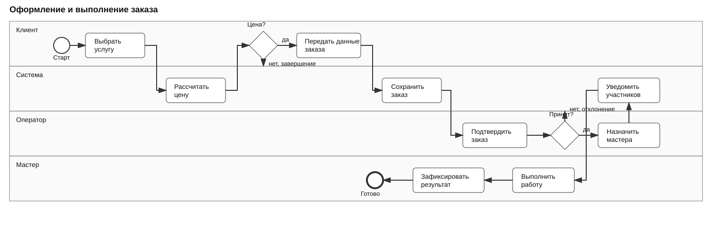

# Бизнес-процессы

## AS-IS

1. Клиент узнаёт об услуге по рекомендации.
2. Клиент звонит владельцу.
3. Владелец уточняет задачу и называет примерную цену.
4. Владелец проверяет личный календарь.
5. Стороны согласуют дату и время.
6. Телефон и описание записываются в календарь или заметки.
7. За несколько часов до заказа владелец звонит клиенту.
8. Клиент подтверждает или отменяет заказ.
9. Владелец выполняет работу.
10. История и доход при необходимости считаются вручную.

Основные проблемы процесса: ручной ввод, несколько мест хранения, риск пропуска заказа, отсутствие общей статистики и зависимость от одного человека.

## TO-BE

1. Клиент выбирает услугу.
2. Система рассчитывает предварительную цену.
3. Клиент указывает контакты, адрес и желаемое время.
4. Система создаёт заказ.
5. Оператор проверяет данные и подтверждает заказ.
6. Оператор выбирает свободный слот и назначает мастера.
7. Система уведомляет клиента и мастера.
8. Мастер выполняет работу и меняет статус.
9. Система сохраняет результат, оплату и историю.
10. Клиент получает предложение оставить оценку.

## Исключения

Клиент может отказаться от цены до создания заказа.

Оператор может отклонить заказ, если услуга недоступна или данных недостаточно.

Если свободного мастера нет, оператор предлагает другое время.

При ошибке уведомления заказ сохраняется, а отправка повторяется.

## BPMN

Исходная модель: [order-process.bpmn](order-process.bpmn).

Версия для просмотра:

Модель не является исполняемой. Она используется для согласования ролей, основного потока и исключений.
