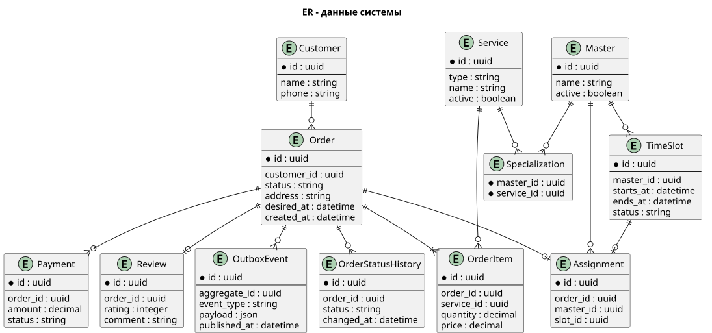

# Модель данных

## Общая модель

Основные сущности системы:

| Сущность | Назначение |
|---|---|
| Customer | Клиент и его контактные данные |
| Service | Вид услуги |
| PriceComponent | Составляющая предварительной цены |
| Order | Заказ клиента |
| OrderItem | Выбранная услуга и параметры |
| OrderStatusHistory | История статусов |
| Master | Исполнитель |
| Specialization | Допустимые виды работ |
| TimeSlot | Доступное время мастера |
| Assignment | Назначение мастера на заказ |
| Payment | Оплата или возврат |
| Review | Оценка выполненной работы |
| AuditLog | Действие сотрудника |

## Данные прототипа

Прототип использует две таблицы.

`orders` хранит заказ, контакт клиента, адрес, вид услуги, желаемое время, статус и даты создания.

`outbox_events` хранит событие до подтверждённой публикации в RabbitMQ.

Персональные данные остаются в `orders`. Поле `payload` таблицы outbox содержит только идентификатор заказа, тип услуги, статус и технические даты.

## ER-диаграмма

Исходник: [data-model.puml](diagrams/data-model.puml).

Просмотр: [data-model.svg](diagrams/data-model.svg).

