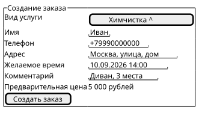
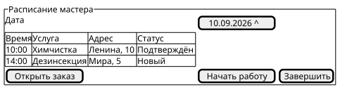
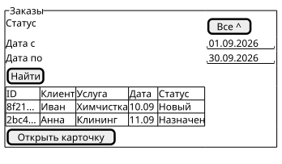

# Интерфейсы

Макеты показывают состав данных и основные действия. Они не задают итоговый дизайн.

## Клиент

Экран содержит выбор услуги, контакты, адрес, желаемое время, комментарий и кнопку создания заказа.

[Исходник](wireframes/client-order.puml) | [SVG](wireframes/client-order.svg)

## Мастер

Экран содержит дату, список назначенных заказов, адрес, время и изменение статуса.

[Исходник](wireframes/master-schedule.puml) | [SVG](wireframes/master-schedule.svg)

## Администратор

Экран содержит фильтры, таблицу заказов и переход к карточке заказа.

[Исходник](wireframes/admin-orders.puml) | [SVG](wireframes/admin-orders.svg)

